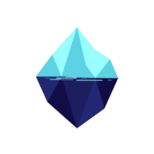
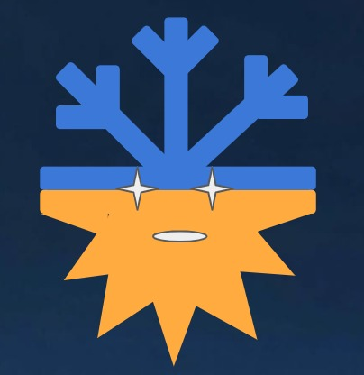
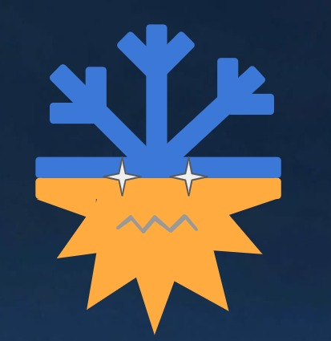
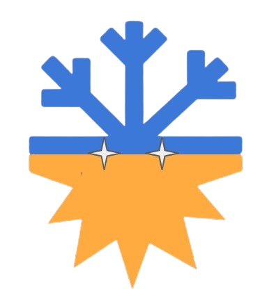

  
  <h1>PLOROPSIS</h1>
  <h3><em>A unified operations command center for safer, smarter and more resilient polar research missions.</em></h3>
   <strong>Snun here</strong> — a snowflake with a flare for drama (literally, I'm half sun). I'll be popping in throughout this README to walk you through the project. Let's go. 

---

## 1. Project Overview

> **Snun says:** *"Picture this — three research stations, one of the harshest environments on Earth, and no single place to see what's actually going on. That's the gap we're closing."*

Polar research stations operate in remote, high-risk environments where a delayed maintenance task, missing equipment item or low medical stock can quickly become an operational threat.

**PLOROPSIS** brings asset health, inventory readiness, station utilization and operational alerts into one decision-support dashboard for India's polar research operations.

The prototype is designed around the NCPOR command workflow and the ISEA-46 operation across **Maitri, Bharati and Himadri** stations.

 

---

## 2. Problem Statement

> **Snun says:** *"This is the part that keeps me up at night (do snowflakes sleep? unclear). Here's what command teams are actually up against:"*

Polar operations currently face a coordination challenge:

- Equipment, supplies and maintenance information can be distributed across disconnected records.
- Command teams need a fast way to identify risks across multiple stations.
- Critical inventory shortages may be discovered too late.
- Asset condition and maintenance schedules are difficult to compare at a glance.
- Operational decisions need a shared, current picture rather than delayed manual reporting.

In an environment where resupply is expensive and weather can restrict access, visibility is a safety and continuity requirement.

 

---

## 3. Our Solution

> **Snun says:** *"Deep breath. Here's how we fix it — one screen, six views, zero guesswork."*

PLOROPSIS provides a single operational picture for expedition managers and command teams.

The platform converts operational records into clear, actionable views:

1. **Readiness overview** — See the current expedition health score and priority risks.
2. **Asset registry** — Search assets by station, category and status, then inspect lifecycle details.
3. **Inventory control** — Monitor quantities, thresholds, consumption and replenishment needs.
4. **Station analytics** — Compare utilization and consumption pressure across research bases.
5. **Operational alerts** — Surface critical issues such as medical stock shortages, overdue inspections and delayed shipments.
6. **Operations map** — Understand the location of stations and the wider operating picture.

 

---

## 4. Key Features

###  Command Center Dashboard

- Expedition readiness score: **87%** in the prototype scenario.
- Total asset and operational asset KPIs.
- Asset health distribution by status.
- Priority attention feed for command teams.
- Station pulse showing utilization by base.

###  Asset Registry

- Asset identity, category, station and condition.
- Operational, maintenance, damaged and missing statuses.
- Last inspection and next maintenance dates.
- Searchable records and asset detail view.

###  Inventory Control

- Stock levels and minimum thresholds.
- Normal, low-stock and critical status indicators.
- Consumption trend visibility.
- Immediate focus on items such as medical kits, batteries and spare filters.

###  Decision Analytics

> **Snun says:** *"My personal favorite section, not that I'm biased."*

- Station utilization comparison.
- Consumption pressure over time.
- Operational health score breakdown.
- Data that supports prioritization instead of guesswork.

 

---

## 5. Example Operational Scenario

> **Snun says:** *"Let me walk you through a morning at command HQ:"*

A command team opens the dashboard before the next review cycle:

1. The readiness score shows that the operation is stable but requires attention.
2. The alert feed identifies medical kits below the critical threshold at Bharati.
3. The asset registry shows a generator at Maitri due for inspection.
4. Analytics shows station utilization and recent consumption pressure.
5. The team can prioritize replenishment, maintenance and logistics actions from one shared view.

**Result:** the team moves from discovering problems late to acting on visible risks early.

 

---

## 6. Innovation and Value

PLOROPSIS is not only a record-keeping interface. It is a common operating picture for difficult, distributed environments.

- **Risk-first visibility:** critical issues are placed where decisions happen.
- **Cross-domain coordination:** assets, inventory and station activity are viewed together.
- **Remote-operations fit:** the interface is optimized for quick scanning and low cognitive load.
- **Preventive operations:** thresholds and maintenance dates help teams act before failure.
- **Extensible foundation:** the same model can support logistics, personnel, maintenance and alert workflows.

---

## 7. Expected Impact

- Reduce time spent consolidating operational reports.
- Improve early detection of asset and inventory risks.
- Support better prioritization of scarce resupply and maintenance resources.
- Improve coordination between command teams and field stations.
- Strengthen operational continuity and researcher safety.
- Create a reusable digital foundation for India's polar missions.

> **Impact metric to validate during pilot:** reduction in time required to identify and assign critical operational actions.

---

## 8. Technology Stack

> **Snun says:** *"For the devs skimming straight to this section — I see you. Here's what's under the hood:"*

- **Frontend:** React, TypeScript and Vite
- **Interface:** Responsive command-center dashboard
- **Visualization:** Recharts and Chart.js
- **Mapping:** Leaflet with OpenStreetMap tiles
- **Icons:** Lucide React
- **Prototype data layer:** Structured mock operational datasets for assets, inventory, consumption and station utilization

The repository also contains a standalone HTML/CSS/JavaScript presentation of the same dashboard flow for lightweight demonstration.

 

---

## 9. Demonstration Flow

> **Snun says:** *"Presenting this at SIH? Follow me step by step and you won't lose the judges:"*

For the SIH presentation, demonstrate the product in this order:

1. Open the **Operations overview** and explain the readiness score.
2. Show the **Needs attention** panel and connect each alert to an action.
3. Open **Asset registry** and inspect one asset lifecycle record.
4. Open **Inventory control** and show how a critical threshold is identified.
5. Open **Decision analytics** and compare station utilization.
6. Close with how the same platform can connect to live station systems.

 

---

## 10. Future Scope

- Connect to live IoT telemetry from generators, freezers and communication systems.
- Add offline-first synchronization for low-connectivity environments.
- Add role-based access for command, logistics, maintenance and station teams.
- Add predictive maintenance using historical asset signals.
- Add demand forecasting for fuel, food, medical supplies and batteries.
- Add shipment tracking and route-risk alerts.
- Integrate secure audit trails and approved operational workflows.
- Add multilingual and accessibility enhancements for wider adoption.

---

## 11. Prototype Scope and Assumptions

This submission is a functional interface prototype using representative operational data. Values such as readiness, asset counts, inventory quantities and utilization are demonstration data and should be replaced with validated mission data before operational deployment.

The prototype demonstrates the user experience, information architecture and decision workflow that a production system can build upon.

---

  
  
<strong>PLOROPSIS turns scattered operational information into one clear, actionable view — helping polar teams prepare earlier, respond faster and operate more safely.</strong>

   That's a wrap from Snun. Star the repo if you made it this far. 

